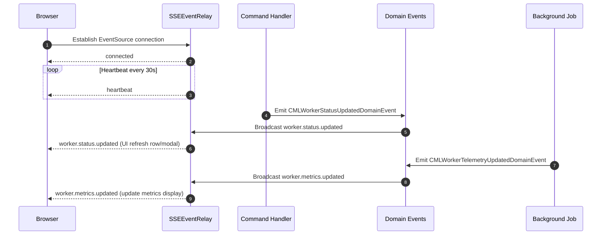

# Real-Time Updates Architecture

> Delivering low-latency UI changes for worker lifecycle, metrics, and labs using Server-Sent Events (SSE).

## Overview

The application provides a push-based real-time channel so the browser reflects backend changes immediately without manual refresh. This is implemented with **Server-Sent Events (SSE)** for simplicity, broad browser support, and one-directional event flow.

| Aspect | Choice | Rationale |
|--------|--------|-----------|
| Protocol | SSE (EventSource) | Lightweight, native in browsers, text/event-stream |
| Transport | HTTP (long-lived) | Reuses existing infrastructure; no extra sockets |
| Direction | Server → Client | UI only needs updates; commands remain HTTP REST |
| Format | JSON payloads | Simple, debuggable in dev tools |
| Event Model | Domain + Application events | Unified abstraction over worker lifecycle & telemetry |

## Endpoint

`GET /api/events/stream`

- Content-Type: `text/event-stream`
- Includes initial `connected` event and `heartbeat` every 30 seconds.
- Closes gracefully with `system.sse.shutdown` on application stop.

## Event Types

| SSE Event | Source | Description |
|-----------|--------|-------------|
| `worker.created` | Domain event handler | New worker aggregate created |
| `worker.status.updated` | Status command / monitoring | EC2 state change mapped to domain status |
| `worker.metrics.updated` | Metrics collection job | Telemetry snapshot (CPU/Mem/Labs count) |
| `worker.labs.updated` | Labs refresh command/job | Lab records synchronized from CML instance |
| `worker.terminated` | Terminate command | Worker lifecycle end |
| `system.sse.shutdown` | Hosted service stop | Relay shutting down (optional UI notice) |

## Flow Diagram

## Frontend Client

`sse-client.js` provides:

- Auto reconnection (exponential backoff capped at 30s)
- Status callbacks (`connected`, `reconnecting`, `disconnected`, `error`)
- Event routing (`on(eventType, handler)`) for UI modules (`workers.js`)
- Toast notifications for key lifecycle events

### Status Badge

A dynamic badge (`Realtime: <status>`) shows live connection state:

| Status | Meaning | UI Color |
|--------|---------|----------|
| connected | Stream healthy | green |
| reconnecting | Backoff in progress | yellow |
| disconnected | Closed / retrying | red |
| error | Transient failure | red |

## Server Components

| Component | Responsibility |
|-----------|---------------|
| `SSEEventRelay` | Manages client queues & broadcasts events |
| `SSEEventRelayHostedService` | Lifecycle (start/stop + future cleanup) |
| Domain Event Handlers | Translate domain events → SSE payloads |
| Commands / Jobs | Trigger domain events or direct broadcast (labs) |

## Extending Events

1. Publish a new domain event or hook existing handler.
2. In handler: `await get_sse_relay().broadcast_event("my.event", { ... })`
3. In UI: `sseClient.on('my.event', data => {/* update UI */})`

## Performance & Scalability

Current design targets moderate connection counts (< hundreds). Future enhancements:

- Backpressure metrics & queue size monitoring
- Client pruning (idle timeout) in hosted service
- Filtering by role or region (add authorization context to generator)
- Optional upgrade path: WebSocket or HTTP/2 for bi-directional communications

## Error Handling

- Dropped events logged if queue put times out (>0.1s)
- Reconnection attempts escalate delay until capped
- UI continues functioning with last known data while reconnecting

## Testing & Debugging

- Use browser DevTools → Network → `events/stream` to inspect raw event frames
- Temporarily add console logs in handlers for verbose tracing
- Simulate failures by stopping backend; observe badge transition

## Future Improvements

| Area | Idea |
|------|------|
| Security | Per-event auth filtering / claim-based masking |
| Efficiency | Batch multiple metric events into single frame when high frequency |
| Observability | Emit OTEL spans for relay broadcast durations |
| Reliability | Replay last N significant events on reconnect |

## FAQ

**Why SSE instead of WebSockets?**
One-directional updates reduce complexity; no need for server-side subscriptions or bidirectional commands. Browsers handle proxy/load-balancer quirks more predictably with standard HTTP.

**How are lab updates delivered?**
Both manual refresh (`RefreshWorkerLabsCommand`) and recurrent job (`LabsRefreshJob`) broadcast `worker.labs.updated` events after synchronization.

**Can I disable real-time updates?**
Remove the SSE connection call in `workers.js` or provide a settings flag to skip initializing the stream for certain deployments.

---
**Next**: See [Worker Monitoring](worker-monitoring.md) for background metrics collection details.
