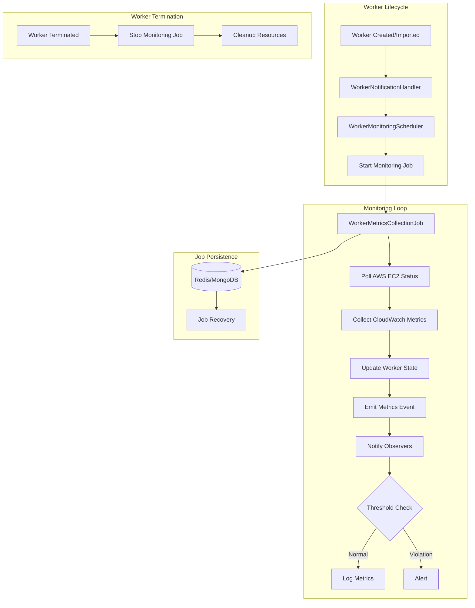

# Worker Monitoring System

The CML Cloud Manager implements an automated worker monitoring system that tracks the health, status, and performance of CML Workers running on AWS EC2 instances.

## Overview

The worker monitoring system provides:

- **Automated Metrics Collection**: Periodic polling of AWS EC2 and CloudWatch APIs
- **Status Synchronization**: Real-time sync between EC2 instance state and worker status
- **Reactive Event Handling**: Observer pattern for metrics processing and alerting
- **Background Job Management**: APScheduler-based distributed job execution

## Architecture



## Key Components

### WorkerMetricsCollectionJob

Background job that collects metrics for a single worker:

```python
from application.services import WorkerMetricsCollectionJob

@backgroundjob(task_type="recurrent")
class WorkerMetricsCollectionJob(RecurrentBackgroundJob):
    """Collects metrics at regular intervals"""
    
    async def run_every(self, *args, **kwargs):
        # 1. Load worker from repository
        # 2. Query EC2 instance status
        # 3. Collect CloudWatch metrics (if running)
        # 4. Update worker telemetry
        # 5. Emit metrics to observers
```

**Features**:

- Runs every 5 minutes (configurable)
- Automatically stops for terminated workers
- Handles missing workers gracefully
- Dependency injection via `configure()` method
- Observer pattern for event emission

### WorkerMonitoringScheduler

Orchestrates monitoring job lifecycle:

```python
from application.services import WorkerMonitoringScheduler

scheduler = WorkerMonitoringScheduler(
    worker_repository=worker_repository,
    aws_client=aws_client,
    notification_handler=notification_handler,
    background_task_bus=background_task_bus,
    background_task_scheduler=background_task_scheduler,
    poll_interval=300  # 5 minutes
)

# Auto-discovers active workers on startup
await scheduler.start_async()

# Manually start monitoring a specific worker
await scheduler.start_monitoring_worker_async(worker_id)

# Stop monitoring when worker is terminated
await scheduler.stop_monitoring_worker_async(worker_id)
```

**Responsibilities**:

- Auto-discover active workers on startup
- Create and schedule `WorkerMetricsCollectionJob` instances
- Track active monitoring jobs by worker ID
- Stop jobs when workers are terminated
- Coordinate with notification handler

### WorkerNotificationHandler

Reactive observer that processes metrics events:

```python
from application.services import WorkerNotificationHandler

handler = WorkerNotificationHandler(
    cpu_threshold=90.0,
    memory_threshold=90.0
)

# Handler is subscribed to job metrics events
job.subscribe(handler)

# Processes events via __call__ method
def __call__(self, metrics_data: Dict[str, Any]) -> None:
    # Check thresholds
    # Log metrics
    # Forward to external systems (future)
```

**Features**:

- CPU/memory threshold monitoring
- Status change detection
- Synchronous event processing
- Extensible for webhooks/alerting

## Metrics Collection Flow

1. **Job Execution** (every 5 minutes)

   ```python
   # WorkerMetricsCollectionJob.run_every()
   worker = await worker_repository.get_by_id_async(worker_id)
   ```

2. **EC2 Status Check**

   ```python
   status_checks = aws_client.get_instance_status_checks(
       aws_region=worker.state.aws_region,
       instance_id=worker.state.aws_instance_id
   )
   ec2_state = status_checks["instance_state"]
   ```

3. **Status Mapping**

   ```python
   new_status = _map_ec2_state_to_cml_status(ec2_state)
   # running -> RUNNING
   # stopped -> STOPPED
   # pending -> PENDING
   # etc.
   ```

4. **CloudWatch Metrics** (if running)

   ```python
   metrics = aws_client.get_instance_resources_utilization(
       aws_region=worker.state.aws_region,
       instance_id=worker.state.aws_instance_id,
       relative_start_time=FIVE_MIN_AGO
   )
   
   worker.update_telemetry(
       cpu_utilization=metrics.avg_cpu_utilization,
       memory_utilization=metrics.avg_memory_utilization,
       last_activity_at=datetime.now(timezone.utc)
   )
   ```

5. **Event Emission**

   ```python
   metrics_data = {
       "worker_id": worker_id,
       "worker_name": worker.state.name,
       "status": new_status.value,
       "metrics": {
           "cpu_utilization": cpu_util,
           "memory_utilization": memory_util
       }
   }
   
   for observer in self._observers:
       observer(metrics_data)
   ```

## Configuration

### Application Settings

```python
# src/application/settings.py

class Settings(ApplicationSettings):
    # Worker Monitoring
    worker_monitoring_enabled: bool = True
    worker_metrics_poll_interval: int = 300  # 5 minutes
    worker_notification_webhooks: list[str] = []
    
    # Background Job Store
    background_job_store: dict[str, Any] = {
        "redis_host": "redis",
        "redis_port": 6379,
        "redis_db": 1
    }
```

### Environment Variables

```bash
# Enable/disable monitoring
WORKER_MONITORING_ENABLED=true

# Polling interval (seconds)
WORKER_METRICS_POLL_INTERVAL=300

# Webhook URLs for notifications (comma-separated)
WORKER_NOTIFICATION_WEBHOOKS=https://hooks.slack.com/services/xxx
```

## Lifecycle Integration

### Application Startup

```python
# main.py

def configure_worker_monitoring(app: FastAPI) -> None:
    """Configure worker monitoring on startup"""
    
    # Get services from DI container
    worker_repository = app.state.services.get_required_service(CMLWorkerRepository)
    aws_client = app.state.services.get_required_service(AwsEc2Client)
    background_task_bus = app.state.services.get_required_service(BackgroundTasksBus)
    background_task_scheduler = app.state.services.get_required_service(BackgroundTaskScheduler)
    
    # Create notification handler
    notification_handler = WorkerNotificationHandler(
        cpu_threshold=90.0,
        memory_threshold=90.0
    )
    
    # Create monitoring scheduler
    scheduler = WorkerMonitoringScheduler(
        worker_repository=worker_repository,
        aws_client=aws_client,
        notification_handler=notification_handler,
        background_task_bus=background_task_bus,
        background_task_scheduler=background_task_scheduler,
        poll_interval=app_settings.worker_metrics_poll_interval
    )
    
    # Add lifecycle hooks
    @app.on_event("startup")
    async def start_monitoring():
        await scheduler.start_async()
    
    @app.on_event("shutdown")
    async def stop_monitoring():
        await scheduler.stop_async()
```

### Worker Registration

When a worker is created or imported, monitoring starts automatically:

```python
# Domain event triggers monitoring
@integration_event_handler(CMLWorkerCreatedDomainEvent)
async def on_worker_created(event: CMLWorkerCreatedDomainEvent):
    await monitoring_scheduler.start_monitoring_worker_async(event.aggregate_id)
```

### Worker Termination

When a worker is terminated, monitoring stops automatically:

```python
# Job checks worker status
if worker.state.status == CMLWorkerStatus.TERMINATED:
    raise Exception("Worker terminated - stopping job")

# Scheduler removes job
await monitoring_scheduler.stop_monitoring_worker_async(worker_id)
```

## Monitoring Data

### Metrics Collected

- **EC2 Instance Status**: running, stopped, pending, terminated
- **CPU Utilization**: Average over 5 minutes (percentage)
- **Memory Utilization**: Average over 5 minutes (percentage)
- **Instance Health**: System status checks, instance status checks
- **Timestamps**: Last activity, last transition time

### Data Storage

Metrics are stored in the worker aggregate:

```python
# domain/entities/cml_worker.py

class CMLWorkerState:
    cpu_utilization: float | None
    memory_utilization: float | None
    active_labs_count: int
    last_activity_at: datetime | None
```

## Observability

### OpenTelemetry Integration

All monitoring operations are traced:

```python
with tracer.start_as_current_span("collect_worker_metrics") as span:
    span.set_attribute("worker_id", worker_id)
    span.set_attribute("aws_instance_id", instance_id)
    span.set_attribute("cpu_utilization", cpu_util)
```

### Logging

Comprehensive logging at each step:

```python
logger.info(f"📊 Collected metrics for worker {worker_id}: CPU={cpu}%, Memory={mem}%")
logger.warning(f"⚠️ HIGH CPU: Worker {worker_id} - {cpu}% (threshold: 90%)")
logger.error(f"❌ Failed to collect metrics for worker {worker_id}: {error}")
```

## Threshold Alerting

### CPU/Memory Thresholds

```python
handler = WorkerNotificationHandler(
    cpu_threshold=90.0,    # Alert if CPU > 90%
    memory_threshold=90.0  # Alert if memory > 90%
)
```

### Alert Processing

When thresholds are exceeded:

1. Log warning message
2. Call `_handle_threshold_violation()` method
3. Future: Send webhook notifications, create tickets, etc.

```python
def _handle_threshold_violation(
    self,
    worker_id: str,
    worker_name: str,
    metric_type: str,  # "cpu" or "memory"
    value: float,
    threshold: float
) -> None:
    logger.warning(
        f"🚨 Threshold Violation: {worker_name} - "
        f"{metric_type.upper()} at {value:.1f}% exceeds {threshold}%"
    )
    
    # TODO: Future integrations
    # - await self._send_webhook_notification(...)
    # - await self._trigger_pagerduty_alert(...)
```

## Error Handling

### Missing Workers

Jobs gracefully handle missing workers:

```python
worker = await worker_repository.get_by_id_async(worker_id)
if not worker:
    logger.warning(f"Worker {worker_id} not found - stopping job")
    raise Exception("Worker not found - terminating job")
```

### AWS API Failures

Transient AWS failures don't stop monitoring:

```python
try:
    status_checks = aws_client.get_instance_status_checks(...)
except Exception as e:
    logger.error(f"Failed to get EC2 status: {e}")
    # Job continues on next interval
```

### Job Deserialization

Dependencies are re-injected after restart:

```python
def configure(self, service_provider=None, **kwargs):
    if service_provider:
        self.aws_ec2_client = service_provider.get_required_service(AwsEc2Client)
        self.worker_repository = service_provider.get_required_service(CMLWorkerRepository)
```

## Best Practices

1. **Poll Interval**: Balance between freshness and API costs (default: 5 minutes)
2. **Threshold Configuration**: Adjust based on workload characteristics
3. **Job Cleanup**: Ensure terminated workers stop monitoring jobs
4. **Error Recovery**: Let jobs fail cleanly for APScheduler retry logic
5. **Observability**: Use tracing and logging for debugging

## Troubleshooting

### Monitoring Not Starting

Check scheduler logs:

```bash
# Look for startup messages
grep "Starting worker monitoring" logs/app.log

# Check active jobs
grep "Started monitoring worker" logs/app.log
```

### Metrics Not Updating

Verify AWS connectivity:

```python
# Check EC2 API access
status = aws_client.get_instance_status_checks(...)

# Check CloudWatch metrics
metrics = aws_client.get_instance_resources_utilization(...)
```

### High Resource Usage

Reduce monitoring frequency:

```python
# Increase poll interval to 10 minutes
worker_metrics_poll_interval: int = 600
```

## Future Enhancements

- **Webhook Notifications**: Send alerts to external systems
- **Auto-Remediation**: Automatically restart failed workers
- **Historical Metrics**: Store time-series data in TimescaleDB
- **Distributed Alerting**: PagerDuty/Opsgenie integration
- **Dashboard Integration**: Real-time metrics visualization

## References

- [Background Task Scheduling](background-scheduling.md)
- [APScheduler Improvements](../../notes/APSCHEDULER_IMPROVEMENTS_COMPLETE.md)
- [Worker Monitoring Architecture](../../notes/WORKER_MONITORING_ARCHITECTURE.md)
