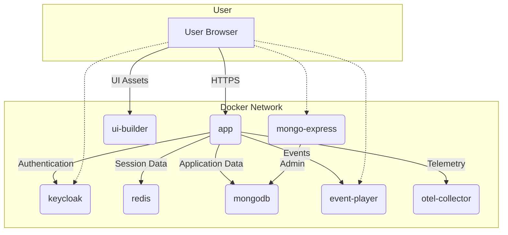

# Docker Environment

This document outlines the Docker environment for the CML Cloud Manager.

## Development Environment

The `docker-compose.yml` file defines the local development stack:

- **app**: The main Python application (API + UI).
- **keycloak**: The authentication server.
- **mongodb**: The database.
- **mongo-express**: A web-based MongoDB admin interface.
- **redis**: A Redis instance for session storage.
- **event-player**: A tool for event gateway/sink, visualization and replay.
- **otel-collector**: The OpenTelemetry collector for observability.

### Usage

```bash
make dev
```

## Production Environment

The `deployment/docker-compose/docker-compose.prod.yml` file defines the hardened production stack:

- **nginx**: Reverse proxy and single entry point.
- **api**: The API service (no background jobs).
- **worker**: The background worker service.
- **keycloak**: Identity provider.
- **mongodb**: Database.
- **redis**: Session store.
- **event-player**: Event gateway.
- **observability**: Full stack (OTEL Collector, Prometheus, Loki, Tempo, Grafana).

### Usage

```bash
make prod-up
```

See [AWS EC2 Deployment](aws-ec2.md) for detailed production instructions.

## Data Flow Diagram (Development)

The following diagram illustrates the services and their interactions within the Docker environment.



## Usage

## Usage

1. Copy the `.env.example` to `.env` and edit it as you see fit...

2. Start the environment, run:

    ```bash
    make up
    ```

3. Check available services, run:

    ```bash
    make urls
    ```

4. Stop the environment, run:

    ```bash
    make down
    ```
