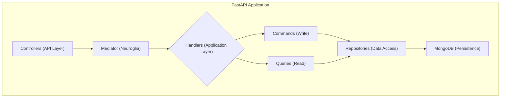

# Welcome to CML Cloud Manager

> A production-ready reference implementation for managing, monitoring, and operating CML Workers with real-time updates, background processing, and role-based access control.

This project demonstrates how to build a modern web application using the **[neuroglia-python](https://github.com/bvandewe/pyneuro)** framework. It provides a solid foundation for clean, scalable, and maintainable applications with Python while showcasing:

- Multi SubApp FastAPI architecture (API + UI)
- CQRS + domain events + background jobs (APScheduler)
- Real-time UI updates via Server-Sent Events (SSE)
- Automated worker & labs refresh cycles
- Role-based access (Admin / Manager / User)
- Observability with OpenTelemetry

**[Online Documentation](https://bvandewe.github.io/cml-cloud-manager/)**

## Getting Started

New to the project? Start here:

1. **Install & Run**: Follow the [Installation Guide](getting-started/installation.md) then [Running the App](getting-started/running-the-app.md).
2. **Login Roles**: Use provided Keycloak test users (`admin`, `manager`, `user`).
3. **Explore Workers**: View current workers; admins/managers can create, start/stop, terminate; all roles can view metrics.
4. **Real-Time Updates**: Watch the status badge and worker list update automatically via SSE.
5. **Labs Data**: Open a worker details modal and switch to the Labs tab to see lab records (auto-refreshed every 30 min + manual refresh).

## Documentation Map

- **Architecture**: Core patterns, CQRS, DI, background processing ([overview](architecture/overview.md))
- **Security**: Authentication flows & RBAC ([auth flows](security/authentication-flows.md))
- **Real-Time Updates**: SSE event stream & UI auto-refresh (see Architecture > Real-Time Updates)
- **Worker Monitoring**: Metrics, labs refresh, thresholds ([worker monitoring](architecture/worker-monitoring.md))
- **Development**: Makefile, testing, docs ([makefile reference](development/makefile-reference.md))
- **Deployment**: Docker & environment setup ([docker environment](deployment/docker-environment.md))

## 🛠️ Technology Stack

### Backend

- **Framework**: [Neuroglia Python](https://github.com/neuroglia-io/python-framework)
- **Web**: [FastAPI](https://fastapi.tiangolo.com/)
- **Database**: [MongoDB](https://www.mongodb.com/) with [Motor](https://motor.readthedocs.io/)
- **Cache**: [Redis](https://redis.io/)
- **Auth**: [Keycloak](https://www.keycloak.org/)

### Frontend

- **Bundler**: [Parcel](https://parceljs.org/)
- **Templates**: [Nunjucks](https://mozilla.github.io/nunjucks/)
- **Styles**: [Bootstrap 5](https://getbootstrap.com/) + [SCSS](https://sass-lang.com/)
- **JavaScript**: ES6 Modules

### Infrastructure

- **Containers**: [Docker](https://www.docker.com/) + [Docker Compose](https://docs.docker.com/compose/)
- **Observability**: [OpenTelemetry](https://opentelemetry.io/)
- **Documentation**: [MkDocs Material](https://squidfunk.github.io/mkdocs-material/)

## 👤 Roles Overview

| Role | Capabilities |
|------|--------------|
| User | View workers, metrics, labs data (read-only) |
| Manager | All User capabilities + start/stop workers, update tags |
| Admin | Full lifecycle (create/import, start/stop, terminate), monitoring control |

Real-time updates & labs visibility apply to all roles; action buttons are filtered by role.

## 🤝 Contributing

This is a starter app template. When adapting for your project:

### Keep the Patterns

- ✅ Authentication architecture
- ✅ CQRS structure
- ✅ Dependency injection setup
- ✅ Frontend build pipeline
- ✅ Docker development environment

### Customize the Domain

- 🔧 Replace Task entities with your models
- 🔧 Update UI components and styling
- 🔧 Configure Keycloak realms and roles
- 🔧 Adapt database schema
- 🔧 Add your API endpoints

### Extend as Needed

- ➕ Additional auth providers
- ➕ More command/query handlers
- ➕ Event sourcing
- ➕ Background jobs
- ➕ API versioning

## 📚 Additional Resources

### Documentation

- [GitHub Repository](https://github.com/bvandewe/cml-cloud-manager)
- [API Documentation](http://localhost:8020/api/docs) (when running)
- [Deployment Guide](deployment/github-pages-setup.md)

### External Links

- [Neuroglia Framework](https://github.com/neuroglia-io/python-framework)
- [FastAPI Docs](https://fastapi.tiangolo.com/)
- [MkDocs Material](https://squidfunk.github.io/mkdocs-material/)

## 🔄 Real-Time & Background Processes

- **SSE Stream**: `/api/events/stream` pushes worker lifecycle, metrics, labs updates.
- **Labs Refresh Job**: Global recurrent job (`labs-refresh-global`) runs every 30 minutes plus once at startup.
- **Metrics Collection**: Poll interval configurable (`worker_metrics_poll_interval`).
- **Status Badge**: Workers view displays connection state: connected / reconnecting / disconnected / error.

## 🆘 Getting Help

1. Check [Common Issues](troubleshooting/common-issues.md)
2. Review relevant documentation section
3. Search [GitHub Issues](https://github.com/bvandewe/cml-cloud-manager/issues)
4. Create a new issue with details

---

**Ready to start?** Head to the [Docker Environment](deployment/docker-environment.md) guide to get your development environment running!
