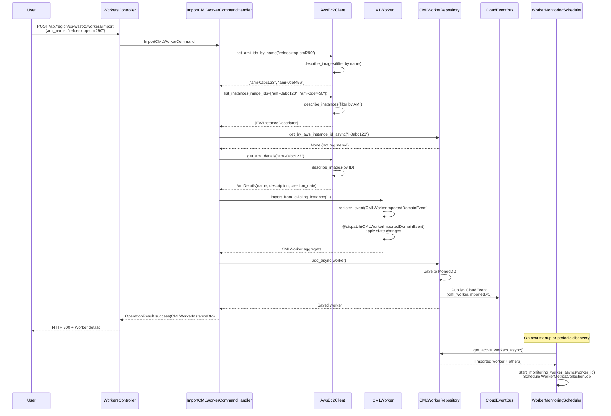

# Import CML Worker by AMI Name - Data Flow Documentation

**Created**: November 17, 2025
**Purpose**: Document the complete data flow when a user imports an existing EC2 instance as a CML Worker by AMI name

---

## Overview

This document traces the complete request flow from the API endpoint through command handling, AWS integration, domain event sourcing, and background monitoring setup when importing an existing EC2 instance by AMI name.

**Key Pattern**: This uses the **Import** pattern (not Create) - discovers and registers existing infrastructure without provisioning new resources.

---

## Data Flow Sequence

### 1. API Request Entry Point

**Controller**: `WorkersController.import_existing_cml_worker()`
**File**: `src/api/controllers/workers_controller.py`
**HTTP Method**: `POST /api/region/{aws_region}/workers/import`

```python
async def import_existing_cml_worker(
    self,
    aws_region: aws_region_annotation,
    request: ImportCMLWorkerRequest,
    token: str = Depends(require_roles("admin")),
) -> Any:
```

**Request Model**: `ImportCMLWorkerRequest` (`src/api/models/cml_worker_requests.py`)

```python
class ImportCMLWorkerRequest(BaseModel):
    aws_instance_id: str | None = None  # Direct lookup
    ami_id: str | None = None           # Search by AMI ID
    ami_name: str | None = None         # Search by AMI name pattern
    name: str | None = None             # Optional custom name
```

**Validation**: Request must provide at least one of: `aws_instance_id`, `ami_id`, or `ami_name`

**Authorization**: Requires `admin` role (enforced by `require_roles("admin")` dependency)

**Action**: Controller creates `ImportCMLWorkerCommand` and dispatches via Mediator

---

### 2. Command Handling

**Handler**: `ImportCMLWorkerCommandHandler`
**File**: `src/application/commands/import_cml_worker_command.py`

#### 2.1 AMI Name Resolution (if `ami_name` provided)

```python
ami_ids = self.aws_ec2_client.get_ami_ids_by_name(
    aws_region=aws_region,
    ami_name=command.ami_name,
)
```

**AWS Integration**: `AwsEc2Client.get_ami_ids_by_name()`
**File**: `src/integration/services/aws_ec2_api_client.py`
**AWS API Call**: `boto3.client('ec2').describe_images(Filters=[{"Name": "name", "Values": [f"*{ami_name}*"]}])`

**Returns**: List of AMI IDs matching the name pattern (wildcard search)

**Example**:

- Input: `ami_name="refdesktop-cml290"`
- AWS Query: Searches for AMIs with names containing "refdesktop-cml290"
- Output: `["ami-0abc123def456", "ami-0xyz789ghi012"]` (all matching AMIs)

**Error Handling**:

- No matches → Returns `bad_request("No AMIs found matching name pattern '{ami_name}'")`
- AWS authentication fails → `EC2AuthenticationException`
- Invalid parameters → `EC2InvalidParameterException`

#### 2.2 Instance Discovery

```python
instances = self.aws_ec2_client.list_instances(
    region_name=aws_region,
    image_ids=ami_ids,  # Filter by resolved AMI IDs
)
```

**AWS Integration**: `AwsEc2Client.list_instances()`
**Returns**: `List[Ec2InstanceDescriptor]` - All EC2 instances using the specified AMI(s)

**Selection Strategy**: Takes **first instance** from results (future enhancement: allow user selection)

**Instance Descriptor** (`Ec2InstanceDescriptor`):

```python
@dataclass
class Ec2InstanceDescriptor:
    id: str                    # AWS instance ID
    type: str                  # Instance type (e.g., "m5zn.metal")
    state: str                 # EC2 state (running, stopped, etc.)
    image_id: str              # AMI ID
    name: str                  # AWS instance name tag
    launch_timestamp: datetime
    launch_time_relative: str
    public_ip: Optional[str]
    private_ip: Optional[str]
```

**Error Handling**:

- No instances found → Returns `bad_request("No matching EC2 instance found")`

#### 2.3 Duplicate Check

```python
existing_worker = await self.cml_worker_repository.get_by_aws_instance_id_async(
    instance.id
)
if existing_worker:
    return self.bad_request(f"Instance {instance.id} is already registered...")
```

**Repository Query**: MongoDB query by `aws_instance_id` field
**Purpose**: Prevent registering the same EC2 instance multiple times

#### 2.4 AMI Metadata Enrichment

```python
ami_details = self.aws_ec2_client.get_ami_details(
    aws_region=aws_region,
    ami_id=instance.image_id
)
```

**AWS Integration**: `AwsEc2Client.get_ami_details()`
**AWS API Call**: `boto3.client('ec2').describe_images(ImageIds=[ami_id])`

**Returns**: `AmiDetails` dataclass with metadata:

```python
@dataclass
class AmiDetails:
    ami_id: str
    ami_name: Optional[str]         # AMI name
    ami_description: Optional[str]  # AMI description
    ami_creation_date: Optional[str] # ISO timestamp
```

**Purpose**: Enrich worker entity with AMI metadata for tracking/reporting

**Fallback**: If AMI details unavailable (permissions issue, AMI deleted), fields set to `None`

#### 2.5 Worker Name Resolution

**Priority**:

1. User-provided `name` parameter (if specified)
2. AWS instance name from tags (if present)
3. Generated name: `f"worker-{instance.id}"`

```python
worker_name = command.name or instance.name or f"worker-{instance.id}"
```

---

### 3. Domain Aggregate Creation

**Factory Method**: `CMLWorker.import_from_existing_instance()`
**File**: `src/domain/entities/cml_worker.py`

```python
worker = CMLWorker.import_from_existing_instance(
    name=worker_name,
    aws_region=command.aws_region,
    aws_instance_id=instance.id,
    instance_type=instance.type,
    ami_id=instance.image_id,
    instance_state=instance.state,
    created_by=command.created_by,
    ami_name=ami_name,
    ami_description=ami_description,
    ami_creation_date=ami_creation_date,
    public_ip=None,  # Will be populated on next status check
    private_ip=None,
)
```

**Pattern**: Uses Neuroglia's **Event Sourcing** pattern - state is reconstructed from events

**Event Emitted**: `CMLWorkerImportedDomainEvent`

---

### 4. Domain Event - Worker Import

**Event**: `CMLWorkerImportedDomainEvent`
**File**: `src/domain/events/cml_worker.py`

```python
@cloudevent("cml_worker.imported.v1")
@dataclass
class CMLWorkerImportedDomainEvent(DomainEvent):
    aggregate_id: str
    name: str
    aws_region: str
    aws_instance_id: str
    instance_type: str
    ami_id: str
    ami_name: Optional[str]
    ami_description: Optional[str]
    ami_creation_date: Optional[str]
    instance_state: str
    public_ip: Optional[str]
    private_ip: Optional[str]
    created_by: Optional[str]
    created_at: datetime
```

**Decorator**: `@cloudevent("cml_worker.imported.v1")` - Published as CloudEvent via CloudEventBus

**Event Handler**: State mutation via `@dispatch` in `CMLWorkerState`

---

### 5. State Reconstruction via Event Sourcing

**State Handler**: `CMLWorkerState.on(CMLWorkerImportedDomainEvent)`
**File**: `src/domain/entities/cml_worker.py`

```python
@dispatch(CMLWorkerImportedDomainEvent)
def on(self, event: CMLWorkerImportedDomainEvent) -> None:
    self.id = event.aggregate_id
    self.name = event.name
    self.aws_region = event.aws_region
    self.aws_instance_id = event.aws_instance_id
    self.instance_type = event.instance_type
    self.ami_id = event.ami_id
    self.ami_name = event.ami_name
    self.ami_description = event.ami_description
    self.ami_creation_date = event.ami_creation_date
    self.public_ip = event.public_ip
    self.private_ip = event.private_ip
    self.created_at = event.created_at
    self.updated_at = event.created_at
    self.created_by = event.created_by

    # Map EC2 state to CMLWorkerStatus
    if event.instance_state == "running":
        self.status = CMLWorkerStatus.RUNNING
    elif event.instance_state == "stopped":
        self.status = CMLWorkerStatus.STOPPED
    elif event.instance_state == "stopping":
        self.status = CMLWorkerStatus.STOPPING
    elif event.instance_state == "pending":
        self.status = CMLWorkerStatus.PENDING
    else:
        self.status = CMLWorkerStatus.UNKNOWN
```

**Pattern**: `@dispatch` decorator from `multipledispatch` library handles event routing

**State Initialization**:

- All AMI fields (`ami_name`, `ami_description`, `ami_creation_date`) populated from event
- `status` derived from EC2 instance state
- `created_at` and `updated_at` set to import timestamp
- Network IPs initially `None` (updated by first metrics collection)

---

### 6. Persistence

**Repository**: `MongoCMLWorkerRepository`
**File**: `src/infrastructure/repositories/mongo_cml_worker_repository.py`

```python
saved_worker = await self.cml_worker_repository.add_async(worker)
```

**Database**: MongoDB collection `cml_workers`

**Automatic Event Publishing**: `MotorRepository` (Neuroglia framework) automatically publishes all pending domain events after successful save:

1. Saves aggregate to MongoDB
2. Publishes all events via `CloudEventBus` (integration with other systems)
3. Dispatches events to registered domain event handlers

**Document Structure** (MongoDB):

```json
{
  "_id": "uuid-generated-id",
  "name": "worker-i-0abc123",
  "aws_region": "us-west-2",
  "aws_instance_id": "i-0abc123def456",
  "instance_type": "m5zn.metal",
  "ami_id": "ami-0abc123def456",
  "ami_name": "refdesktop-cml290",
  "ami_description": "Reference Desktop CML 2.9.0 AMI",
  "ami_creation_date": "2024-10-15T12:30:00.000Z",
  "status": "RUNNING",
  "service_status": "UNAVAILABLE",
  "created_at": "2025-11-17T10:00:00.000Z",
  "updated_at": "2025-11-17T10:00:00.000Z",
  "created_by": "admin@example.com",
  // ... other fields initialized to defaults
}
```

---

### 7. Response DTO Construction

**DTO**: `CMLWorkerInstanceDto`
**File**: `src/integration/models/cml_worker_instance_dto.py`

```python
instance_dto = CMLWorkerInstanceDto(
    id=saved_worker.id(),
    aws_instance_id=instance.id,
    aws_region=aws_region,
    instance_name=worker_name,
    ami_id=instance.image_id,
    ami_name=ami_name,
    instance_type=instance.type,
    instance_state=instance.state,
    security_group_ids=[],  # Not available from descriptor
    subnet_id="",           # Not available from descriptor
    public_ip=None,
    private_ip=None,
    tags={},
)

return self.ok(instance_dto)
```

**Response**: `OperationResult.success(instance_dto)` wrapped with HTTP 200 status

---

### 8. Event Broadcasting via CloudEvents

**Event Bus**: `CloudEventBus` (Neuroglia framework)
**File**: `src/application/commands/import_cml_worker_command.py` (via `CommandHandlerBase`)

**Published Event**:

- **Type**: `cml_worker.imported.v1`
- **Source**: `/cml-cloud-manager/workers`
- **Format**: CloudEvents v1.0 specification
- **Transport**: Configured via `CloudEventPublishingOptions` (HTTP/AMQP/Kafka)

**Purpose**: External system integration (notifications, audit trails, orchestration)

---

### 9. Domain Event Handlers (Application Layer)

**Note**: Unlike `CMLWorkerCreatedDomainEvent`, there is **NO dedicated SSE handler for `CMLWorkerImportedDomainEvent`** in the current codebase.

**Potential Enhancement**: Add `CMLWorkerImportedDomainEventHandler` to broadcast SSE notification:

```python
# NOT CURRENTLY IMPLEMENTED - Future Enhancement
class CMLWorkerImportedDomainEventHandler(
    DomainEventHandler[CMLWorkerImportedDomainEvent]
):
    def __init__(self, sse_relay: SSEEventRelay):
        self._sse_relay = sse_relay

    async def handle_async(self, notification: CMLWorkerImportedDomainEvent) -> None:
        await self._sse_relay.broadcast_event(
            event_type="worker.imported",
            data={
                "worker_id": notification.aggregate_id,
                "name": notification.name,
                "region": notification.aws_region,
                "instance_id": notification.aws_instance_id,
                "ami_name": notification.ami_name,
                "imported_at": notification.created_at.isoformat() + "Z",
            },
            source="domain.cml_worker",
        )
```

**Current Behavior**: Frontend receives worker via polling or refresh (no real-time notification)

---

### 10. Background Monitoring Setup

**Trigger**: Application startup with `lifespan_with_monitoring` context manager
**File**: `src/main.py`

```python
# On application startup
async with lifespan_with_monitoring(app):
    # Auto-discover active workers
    active_workers = await worker_repository.get_active_workers_async()

    # Schedule monitoring jobs for each worker
    for worker in active_workers:
        await monitoring_scheduler.start_monitoring_worker_async(worker.id())
```

**Background Job**: `WorkerMetricsCollectionJob`
**File**: `src/application/services/worker_metrics_collection_job.py`

**Job Configuration**:

- **Type**: Recurrent job (APScheduler)
- **Interval**: 5 minutes (configurable via `WORKER_METRICS_POLL_INTERVAL`)
- **Decorator**: `@backgroundjob(task_type="recurrent")`

**Job Execution** (per worker):

1. Dispatch `RefreshWorkerMetricsCommand` via Mediator
2. Collect EC2 status (instance state, system checks)
3. Collect CloudWatch metrics (CPU, memory) if detailed monitoring enabled
4. Collect CML metrics (labs, system info, license) if CML API reachable
5. Publish domain events: `EC2InstanceDetailsUpdatedDomainEvent`, `CloudWatchMetricsUpdatedDomainEvent`, `CMLMetricsUpdatedDomainEvent`
6. SSE broadcast: `worker.metrics.updated` event to connected clients

**Monitoring Lifecycle**:

- Started: On app startup for all active workers
- Stopped: When worker terminated (via `CMLWorkerTerminatedDomainEventHandler`)
- Auto-restart: If job crashes, APScheduler reschedules based on configuration

---

## Key Components Summary

### API Layer

- **Controller**: `WorkersController.import_existing_cml_worker()`
- **Request DTO**: `ImportCMLWorkerRequest`
- **Response DTO**: `CMLWorkerInstanceDto`
- **Authorization**: Requires `admin` role

### Application Layer (CQRS)

- **Command**: `ImportCMLWorkerCommand`
- **Handler**: `ImportCMLWorkerCommandHandler`
- **Repository**: `CMLWorkerRepository` (MongoDB-backed)

### Integration Layer

- **AWS Client**: `AwsEc2Client`
- **AWS APIs Used**:
  - `describe_images` (AMI lookup by name)
  - `describe_instances` (instance discovery by AMI)
  - `describe_images` (AMI metadata enrichment)

### Domain Layer

- **Aggregate**: `CMLWorker`
- **Factory Method**: `import_from_existing_instance()`
- **Domain Event**: `CMLWorkerImportedDomainEvent`
- **State Handler**: `CMLWorkerState.on(CMLWorkerImportedDomainEvent)`

### Background Processing

- **Scheduler**: `WorkerMonitoringScheduler`
- **Job**: `WorkerMetricsCollectionJob`
- **Trigger**: Auto-discovery on startup

---

## AWS API Interactions

### 1. AMI Discovery by Name

**API**: `ec2:DescribeImages`
**Filter**: `name` with wildcard pattern
**Permissions Required**: `ec2:DescribeImages`

```python
ec2_client.describe_images(
    Filters=[{"Name": "name", "Values": [f"*{ami_name}*"]}]
)
```

### 2. Instance Discovery by AMI

**API**: `ec2:DescribeInstances`
**Filter**: `image-id` (multiple AMI IDs)
**Permissions Required**: `ec2:DescribeInstances`

```python
ec2_client.describe_instances(
    Filters=[{"Name": "image-id", "Values": ami_ids}]
)
```

### 3. AMI Metadata Enrichment

**API**: `ec2:DescribeImages`
**Query**: Direct lookup by AMI ID
**Permissions Required**: `ec2:DescribeImages`

```python
ec2_client.describe_images(ImageIds=[ami_id])
```

---

## Error Scenarios

### 1. AMI Name Not Found

**Trigger**: No AMIs match the name pattern
**Response**: `400 Bad Request`
**Message**: `"No AMIs found matching name pattern '{ami_name}'"`

### 2. No Instances Found

**Trigger**: AMI exists but no instances using it
**Response**: `400 Bad Request`
**Message**: `"No matching EC2 instance found"`

### 3. Instance Already Registered

**Trigger**: Instance ID already exists in database
**Response**: `400 Bad Request`
**Message**: `"Instance {id} is already registered as worker '{name}' (ID: {id})"`

### 4. AWS Authentication Failure

**Trigger**: Invalid credentials or insufficient permissions
**Response**: `400 Bad Request`
**Exception**: `EC2AuthenticationException`

### 5. Invalid Parameters

**Trigger**: Malformed AMI name or region
**Response**: `400 Bad Request`
**Exception**: `EC2InvalidParameterException`

---

## Tracing & Observability

### OpenTelemetry Spans

**Root Span**: `handle_async` (command handler)

**Child Spans**:

1. `discover_ec2_instance` - AMI/instance lookup phase
   - Attributes: `ec2.lookup_method`, `ec2.ami_name`, `ec2.resolved_ami_ids`
2. `check_duplicate_worker` - Database duplicate check
   - Attributes: `worker.already_exists`, `worker.existing_id`
3. `create_worker_from_import` - Domain aggregate creation
   - Attributes: `cml_worker.id`, `cml_worker.name`, `cml_worker.status`
4. `save_imported_worker` - Repository persistence
   - Attributes: (auto-generated by repository)

**Span Attributes Examples**:

```python
{
    "cml_worker.import.region": "us-west-2",
    "cml_worker.import.has_ami_name": True,
    "ec2.lookup_method": "ami_name",
    "ec2.ami_name": "refdesktop-cml290",
    "ec2.resolved_ami_ids": "ami-0abc123,ami-0def456",
    "ec2.instance_id": "i-0abc123",
    "cml_worker.id": "uuid-generated",
    "cml_worker.name": "worker-i-0abc123",
    "cml_worker.status": "running"
}
```

---

## Sequence Diagram



---

## Future Enhancements

### 1. Real-Time UI Notification

**Issue**: No SSE event broadcasted on import
**Solution**: Add `CMLWorkerImportedDomainEventHandler` with SSE relay injection
**Impact**: Frontend receives real-time notification instead of polling

### 2. Multiple Instance Selection

**Issue**: When multiple instances match AMI criteria, first is chosen automatically
**Solution**: Return list of candidates and let user select
**UI Flow**: Import wizard with instance selection step

### 3. AMI Permission Validation

**Issue**: Silent failure if AMI details unavailable (permissions)
**Solution**: Explicit validation step checking AMI accessibility
**Error Message**: "Cannot access AMI details - check IAM permissions"

### 4. Bulk Import

**Issue**: Must import workers one at a time
**Solution**: `ImportCMLWorkersCommand` with batch processing
**Use Case**: Import 10+ workers from same AMI pattern

### 5. Import Dry-Run Mode

**Issue**: No way to preview what will be imported
**Solution**: Add `dry_run` parameter to list matches without persisting
**Response**: List of instances that would be imported

---

## Related Documentation

- **AMI Persistence Issue**: `notes/REFRESH_WORKER_METRICS_IMPLEMENTATION_PLAN.md` - Debugging AMI fields not saving
- **Background Monitoring**: `notes/WORKER_MONITORING_ARCHITECTURE.md` - Scheduler and job lifecycle
- **AWS Client**: `docs/aws-client-status-and-tags.md` - AWS integration patterns
- **Domain Events**: `docs/architecture/domain-events.md` - Event sourcing implementation
- **CloudEvents**: `notes/CLOUDEVENT_PUBLISHING_FIX.md` - CloudEvent bus integration
- **Authentication**: `notes/AUTHENTICATION_ARCHITECTURE.md` - Role-based access control

---

## Testing Scenarios

### Unit Tests

- `ImportCMLWorkerCommandHandler` with mocked AWS client
- AMI name resolution with various patterns
- Duplicate detection logic
- State reconstruction from `CMLWorkerImportedDomainEvent`

### Integration Tests

- End-to-end import flow with test AWS account
- AMI lookup with real AWS API calls
- MongoDB persistence verification
- CloudEvent publishing validation

### Manual Testing

```bash
# Prerequisites
export AWS_ACCESS_KEY_ID="..."
export AWS_SECRET_ACCESS_KEY="..."
export CML_WORKER_AMI_NAME_DEFAULT="refdesktop-cml290"

# Test import by AMI name
curl -X POST "http://localhost:8000/api/region/us-west-2/workers/import" \
  -H "Authorization: Bearer $TOKEN" \
  -H "Content-Type: application/json" \
  -d '{"ami_name": "refdesktop-cml290"}'

# Verify worker in database
mongosh cml_cloud_manager --eval 'db.cml_workers.find({}, {name:1, ami_name:1, ami_description:1}).pretty()'

# Verify monitoring job scheduled
curl "http://localhost:8000/api/system/scheduler/jobs"
```

---

## Changelog

- **2025-11-17**: Initial documentation created
- **Future**: Add SSE event handler implementation
- **Future**: Document bulk import feature
